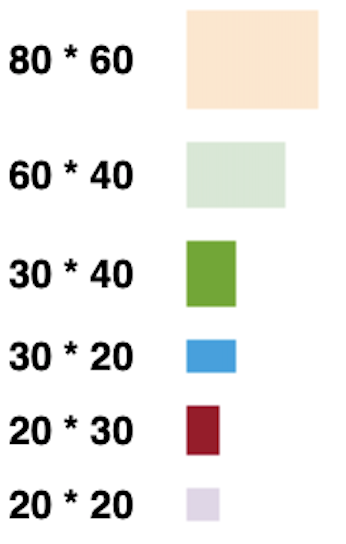
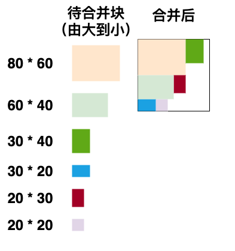
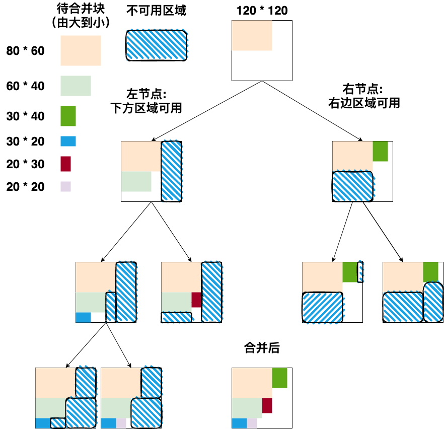
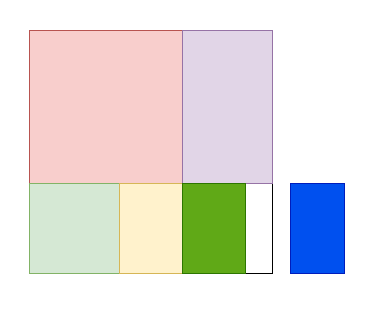
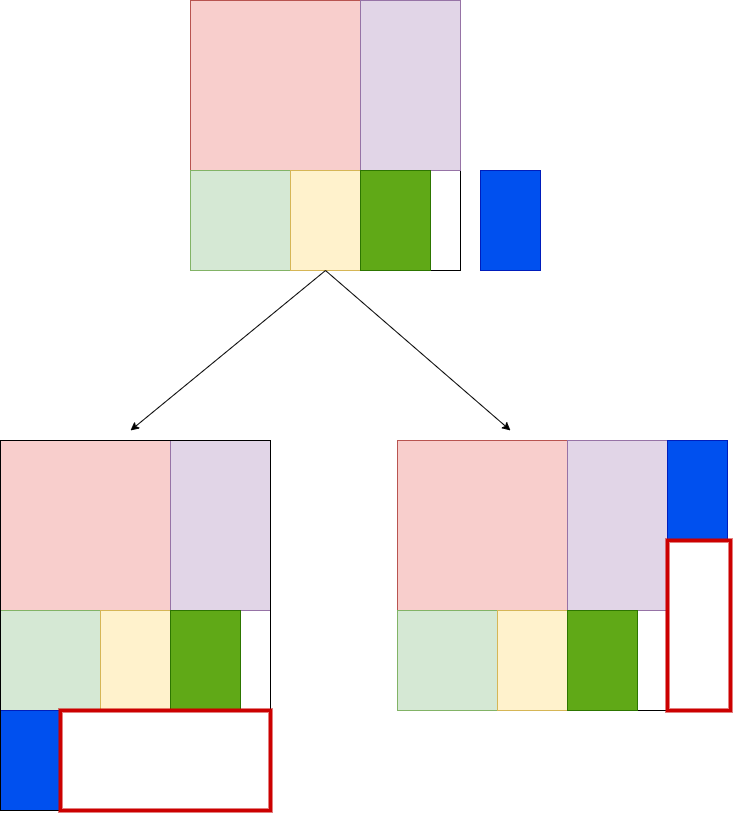
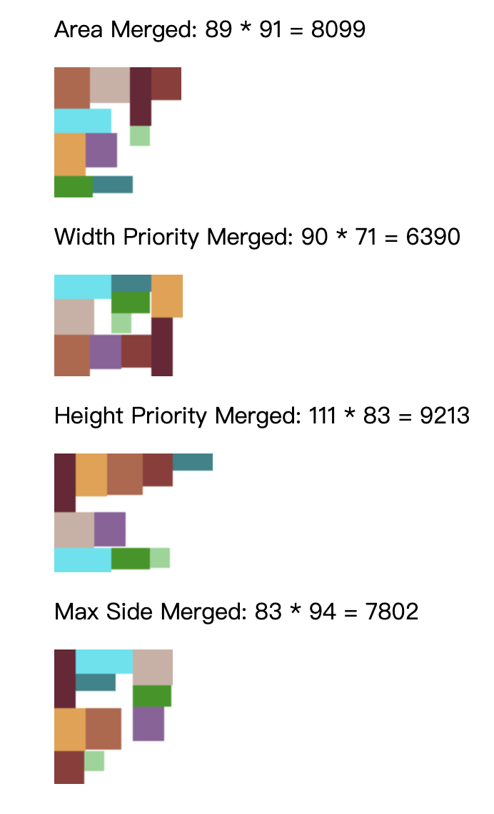
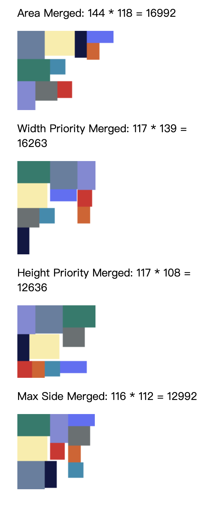

# Sprite揭秘
---

## 简介 Introduction

精灵图（英语：[Sprite](https://terms.naer.edu.tw/detail/3268800/)），又被称为雪碧图或拼合图。在计算机图形学中，当一张二维图像集成进场景中，成为整个显示图像的一部分时，这张图就称为精灵图。

常见碳酸饮料雪碧的英文名也是 `Sprite`，因此也有人会使用雪碧图的非正式译名。

精灵图起源于街机游戏，首次作为图形术语出现，是在德州仪器的9918(A)视频显示处理器上。当时的意思是独立于背景的独立移动的二维图被称为 `Sprite`。

---

## 前端应用 Application

这个概念影响之后许多游戏引擎和整个前端行业，例如使用`JavaScript`的游戏引擎：Egret中的`SpriteSheet`、Cocos Creator中的`Sprite Frame`。前端开发中常见的`CSS Image Sprites`，使用`background-position`从一张精灵图上渲染不同的icon，还可以配合`keyframes`制作动画。

在前端性能优化的时候，其中图片优化最有效也是频率最高的就是CSS精灵图，把多张图片融合成一张图片，然后通过css `background-position`取指定位置的图片，减少了http请求次数自然减少了加载时间。

---

### 简单动画 Animation Demo

下面来简单的看一下如何使用精灵图配合`keyframes`制作简单的动画


---

```html
<style>
.cat {
    width: 292px;
    height: 148px;
    background: url(./cat.png);
    animation-name: run;
    animation-duration: .5s;
    animation-timing-function: steps(5);
    animation-iteration-count: infinite;
}

@keyframes run {
    from {
        background-position-x: 0;
    }

    to {
        background-position-x: -1494px;
    }
}
</style>
<body>
    <div class="cat"></div>
</body>
```
---


在前端开发还处于刀耕火种的年代，拼合一张精灵图是通过PhotoShop，将一堆图标放到一张图里，这样使用精灵图虽然优化了性能，但是当几百张小图合并在一张图之后，想要修改其中的一张，就要让UI重新出图，不改图片尺寸还好，改了尺寸修改`position`的工作量非常大。

进入到现在前端开发更加工程化、自动化的时代，就有了很多解放生产力的工具，比如我们可以通过[webpack-spritesmith](https://github.com/mixtur/webpack-spritesmith)，配合webpack就可以将一堆零散的图片打包到一张图片当中，并且还可以自动生成相关的css数据。

---

## 实现 Implement


如何将这些小图片拼合在一张大图上，这里列举了四种方式:


---

很明显前三种的空间利用率都很低，最后会导致生成的图片尺寸非常的大，并且非常宽或高的图像。


这里要分享的就是第四种二叉树的方式进行打包，这是将物品装入尽可能小的容器中的有效方法。

---

### 布局 Layout

先来看一下如何这些色块放到一个指定的大小的空间里



---

这里将依次把`(宽度 * 高度)`为：

1. `80 * 60`
2. `60 * 40`
3. `30 * 40`
4. `30 * 20`
5. `20 * 30`
6. `20 * 20`

的色块放入到`120 * 120`的容器中去。


---


1. 在左上角放置最大的1号`80 * 60`色块
> 容器被分为一级左节点（下方可用 `80 * 60`） 和 一级右节点 （右边可用 `40 * 120`）

2. 继续插入2号`60 * 40`色块，左节点可以放下色块，直接在左节点的左上角放入色块
> 一级左节点被分为二级左节点1（下方可用`60 * 20`）和 二级右节点2（右边可用`20 * 60`）

---


3. 继续插入3号`30 * 40`色块，二级左右节点均无法插入
   
4. 返回一级右节点，可以插入，放在右侧可用区域左上角
> 一级右节点被分为二级左节点3（下方可用`40 * 80`）和 二级右节点4（右边可用`10 * 40`）

---


5. 继续插入4号`30 * 20`色块，二级左节点1（下方可用`60 * 20`）可以插入
> 下方没有剩余空间了，三级左节点不可用，三级右节点（右边可用`30 * 20`）

6. 依此类推，将所有色块插入 ...

完成以上搜索插入的步骤之后就可以得到一颗带有色块布局信息的二叉树。

---

### 构建 Construct

#### 节点 Block
定义一个Block类，用来描述二叉树的节点：

```ts
export default class Block {
    public x = 0;               //节点横坐标
    public y = 0;               //节点纵坐标
    public right?: Block;       // 右侧节点
    public down?: Block;        // 下方节点

    constructor(
        public width: number,   // 图片宽度
        public height: number,  // 图片高度
        public used: boolean,   // 该块是否被使用
        public index?: number   // 图片索引
    ) { }
}
```
---

#### 搜索 Search

定义完Block之后，按照上述步骤，我们接下来要做的是需要搜索出符合插入目标体积的Block，我们可以通过递归的方式进行：

```ts
function searchBlock(block: Block, width: number, height: number): Block | null {
    if (!block) return null;
    if (block.used) {
        const b = searchBlock(block.down as Block, width, height);
        if (b) return b;
        return searchBlock(block.right as Block, width, height);
    } else {
        if (block.width >= width && block.height >= height) return block;
        return null;
    }
}
```
---

#### 插入与分割 Insert And Split

如果搜索到可用的块，那么就进行插入操作，然后将该块进行分割：

```ts
const block = searchBlock(root, item.width, item.height);

const splitBlock = (block: Block, item: Item) => {
    block.used = true;
    block.index = item.index;
    if (block.width > item.width) {
        block.right = new Block(block.width - item.width, item.height, false);
        block.right.x = block.x + item.width;
        block.right.y = block.y;
    }
    
    if (block.height > item.height) {
        block.down = new Block(block.width, block.height - item.height, false);
        block.down.x = block.x;
        block.down.y = block.y + item.height;
    }
}

if (block) splitBlock(block, item);
```
---

### 合并 Merge

构建完带有布局信息的二叉树之后，我们就可以从根节点开始遍历，依次打印整棵二叉树，将每个节点按照布局信息，添加到一张新的画布上，就可以得到得到精灵图。

```ts
const resultLayout: Layout[] = [];
const mergeImages = (block: Block, ctx: CanvasRenderingContext2D) => {
    if (block.index !== undefined) {
        const image = images[block.index];
        ctx.drawImage(image, block.x, block.y, image.width, image.height);
        resultLayout.push({
            image,
            x: block.x,
            y: block.y,
            width: image.width,
            height: image.height,
        });
    }
    if (block.down) mergeImages(block.down, ctx, resultLayout);
    if (block.right) mergeImages(block.right, ctx, resultLayout);
};
```
---

### 自增长 Self-growth

我们将几张小图打包进了一个`120 * 120`的容器中，但是如果有更多的图片需要进行合并呢？我们该如何确定这个画布的大小，这里我们采用让画布自增长的形式去解决这个问题。

如下图所示，当此时画布只剩下右下角一块白色区域时，我们的蓝色块，已经无法继续插入画布。



---

那么我们可以将蓝色块放在画布的下面或者放在画布的右边，此时画布被蓝色块扩充出新的红框区域。



所以，在初始化画布的时候，我们可以将画布设置为第一个节点的大小，然后在`searchBlock`返回`null`的时候，进行自增长操作。

---

那么我们应该是选择往下增长，还是往右增长画布呢？这里我们期待的是画布可以尽可能的保持一个方形，既不想它太高也不想它太宽，所以需要对增长方向做判断：

- 如果画布比色块宽，向下增长
- 如果画布比色块高，向右增长

---

```ts
if (root.width > root.height) {
    // 如果当前画布宽度大于高度，为了尽可能的保持方形，向下增长
    // 新建一个空的块，和当前画布同宽，和目标块同高，放到当前画布下方
    const block = new Block(root.width, item.height, false);
    block.x = 0;
    block.y = root.height;

    // 更新当前画布
    const newRoot = new Block(root.width, root.height + item.height, true);
    newRoot.x = 0;
    newRoot.y = 0;
    newRoot.down = block;
    newRoot.right = root;
    root = newRoot;
} else {
    // 向右增长 ...
}
```
---

如何保证自增长的两个先决条件

> - 如果画布比色块宽，向下增长
> - 如果画布比色块高，向右增长

也就是**画布的边一定大于等于一定大于等于目标块的边**成立呢？

我们需要先对所有目标进行从大到小的排序。

---

### 排序 Sort

这里提供四种排序规则：

- 高度排序
- 宽度排序
- 面积排序
- 按最大（宽度，高度）排序

不同的排序规则和不同的待合并元素的组合会产生不同的精灵图，那么如何产出最优解呢？最直观的方法就是执行各个排序算法然后生成精灵图再进行比较，但是  `JavaScript`是单线程的，它的长时间执行会阻塞页面。




---

### 多线程 Web Worker

我们可以使用Web Worker，将为每一种排序分配一个线程，同时计算，最后在所有结果中寻找最优解。

---

#### 通信 Communication
  
  主线程

```ts
import MaxSideSortWorker from './Wokers/maxSideSort.worker';

const maxSideSortWorker = new Worker(
    new URL('./workers/maxSideSort.worker', import.meta.url)
);

maxSideSortWorker.onmessage = (event: MessageEvent) => {
    // 从子线程接受消息 event.data
    // 处理完数据后终止子线程
    maxSideSortWorker.terminate();
};

```
---

  子线程：新建子线程文件 `maxSideSort.worker.ts`
    
```ts
// 创建主线程this指针
const webWorker = self as any as Worker; 

webWorker.onmessage = (event: MessageEvent) => { 
    const items = event.data as Item[];
    items.sort((a, b) => maxSideSort(a, b));

    const root = layout(items);
    webWorker.postMessage(root);
    self.close();
};
```

---

#### 异步处理 Asynchronous processing

由于每个worker独立负责自己的运算，并且通过事件通知的方式发送运算结果给主线程，所以这里需要处理异步结果，为每个worker创建一个`defer`，然后通过`Promise.all`等待全部线程结束，就可以拿到结果。

```ts
const maxSideSortDefer: Q.Deferred<SortResult> = Q.defer();
const areaSortDefer: Q.Deferred<SortResult> = Q.defer();
const widthPrioritySortDefer: Q.Deferred<SortResult> = Q.defer();
const heightPrioritySortDefer: Q.Deferred<SortResult> = Q.defer();


const allDefer = [
    areaSortDefer.promise,
    widthPrioritySortDefer.promise,
    heightPrioritySortDefer.promise,
    maxSideSortDefer.promise,
];

const sortResults = await Promise.all(allDefer);
```

---

## [在线Demo预览](https://sivanzheng.github.io/texture-merger-test/dist/index.html)

## 源码 Source code

[https://github.com/sivanzheng/texture-merger](https://github.com/sivanzheng/texture-merger)

[幻灯片](https://github.com/sivanzheng/Share/blob/master/Sprite/README.md) [Demo源码](https://github.com/sivanzheng/texture-merger-test)

## 工具 Tools
幻灯片
[marp](https://marp.app/)
> Create beautiful slide decks using an intuitive Markdown experience.

绘图
[diagrams](https://app.diagrams.net/?src=about)
> Complex diagramming on an online whiteboard.
